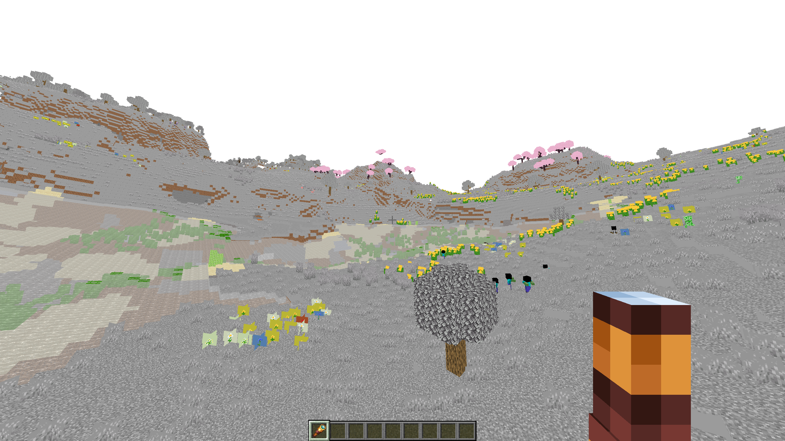

# learnshaders
Based on Samuel Gerkin's distant horizons supported shader [tutorial](https://www.youtube.com/watch?v=RjyNVmsTBmA).
# Getting Started
1. Download the [iris](https://www.irisshaders.dev/download) installer and get Iris + Fabric **1.21**
2. Open the Minecraft Launcher, select most recent version of Fabric and start the game
3. Grab these 1.21 compatible mods off [modrinth](https://modrinth.com/mods)
   1. [Fabric API](https://modrinth.com/mod/fabric-api)
   2. [Distant Horizons](https://modrinth.com/mod/distanthorizons)
   3. [Indium](https://modrinth.com/mod/indium)

4. Add additional RAM to the -Xmx flag (i.e.) -Xmx8G)
5. Open a new world and run

# Creating The Shaderpack
1. Open `%APPDATA%/.minecraft/shaderpacks/` and create a new folder, name it whatever you would like.
2. Inside that folder, make one named `shaders/`. You should work in there.
3. Create your vertex & fragment shaders, and start cooking with at least GLSL `version #430`
4. sp614'x [OptifineDoc](https://github.com/sp614x/optifine/blob/master/OptiFineDoc/doc/shaders.txt) is a necessity, https://learnopengl.com/Getting-started/Coordinate-Systems is helpful refresher.
5. The [shaderLABS](https://shaderlabs.org/wiki/Main_Page) discord has a lot of useful resources, including the `spaces.png` in this repo.

# Screenshots (Progressive)

